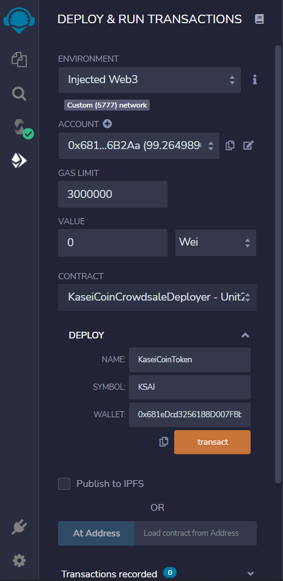

# Martian Token Crowdsale
This prototype project involves three Solidity smart contracts that would allow people moving to Mars to convert their earthling money to a proposed new cryptocurrency named KaseiCoin. The KaseCoin would be an ERC-20 compliant fungible token, and the currency conversion would be accomplished through a crowdsale.  

## Technologies
The technologies required to use this project are: Remix IDE, MetaMask, and Ganache.

## Examples
Upon deploying the KaseiCoinCrowdsaleDeployer contract, the other two contracts are also created and can be loaded using their contract addresses. Details of how to deploy and load the smart contracts are shown in the "Deployment" section below. Once the KaseiCoin and KaseiCoinCrowdsale smart contracts are loaded, users can buy new tokens for recipient addresses and check the balances of the accounts. They can also view the total supply of minted tokens and the how much wei the crowdsale contract has raised.   

**Deployment:**

In the "Deploy and Run Transactions" pane, the Injected Web3 environment rather than the JavaScript VM must be selected. In addition, the smart contracts must be deployed in a particular order. From the "Contract" dropdown list, the KaseiCoinCrowdsaleDeployer contract should be selected as the first contract to deploy. There are three fields: Name, Symbol, and Wallet that need to be filled in before clicking the transact button.

**Buying New Tokens:**

**Checking Total Supply and Amount Raised:**

